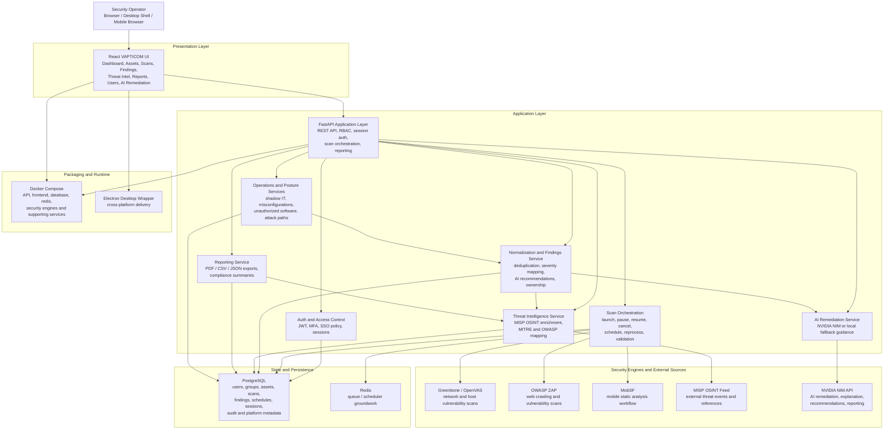

# VAPTICOM Architecture Diagram

This document provides a detailed visual architecture for the current VAPTICOM platform implementation.

## High-Level System Diagram

## Logical Boundaries

- Presentation layer: responsive React client and desktop wrapper.
- Application layer: FastAPI routers plus service modules for auth, scans, findings, AI, reporting, and posture.
- Data layer: PostgreSQL for durable state and Redis for queue and schedule support.
- Engine layer: Greenbone, ZAP, MobSF, and MISP feed integrations.
- Intelligence layer: MITRE, OWASP, compliance mapping, and NVIDIA NIM-powered remediation assistance.

## Primary Runtime Paths

1. User logs in through the UI and receives a JWT-backed session.
2. UI loads dashboard, scans, findings, assets, users, posture, and threat summary from the FastAPI API.
3. Scan orchestration launches network, web, or mobile jobs through the corresponding engine adapters.
4. Engine results are normalized into common findings records and stored in PostgreSQL.
5. Findings are enriched with threat intelligence, compliance mapping, AI guidance, and ownership metadata.
6. Dashboard and reports render the normalized and enriched data back to the user.
